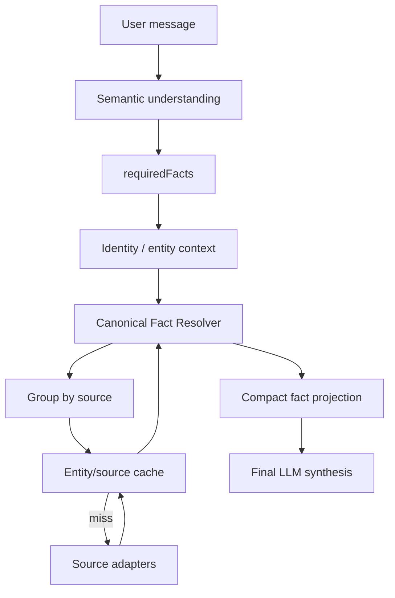

# Canonical Domain Fact Resolver v1 — implementation report

## Scope and branch

- Branch: `feat/canonical-domain-fact-resolver`
- Base: `feat/ai-runtime-efficiency-pass` (`8c40413`)
- Merge: not performed
- Runtime target: current AI Lab semantic path, not the legacy deterministic fact runtime

## 1. Audited runtime before the change

The production-like Manual AI Lab path was:

```text
semantic-probe
  → probe.evidenceNeeds (natural-language facts)
  → planLiveDataNeeds
  → keyword/tool-name routing in semantic-tool-broker
  → live-tool-runtime
  → broad tool result payloads
  → final tool synthesis
```

The older `fact-catalog.js` / `fact-runtime.js` already had useful TTL, grouping and ingestion ideas, but it was not the primary Lab path. The modern broker intentionally did not import that legacy runtime.

Main findings:

1. The LLM selected natural-language evidence needs, but the broker then guessed tools again from words.
2. `billing.balance` and `billing.tariff` shared the same Billing DOM source, but remained separate upper-level tool calls.
3. The final LLM received projected subsets for some tools, but the abstraction was still tool-centric and not canonical-fact-centric.
4. Lab state retained a subscriber binding, but not an explicit active Building/Connection domain context.
5. `customer.snapshot` was still commonly available as a broad recovery mechanism.
6. A broad snapshot could contain fields with different observation ages; source freshness alone was insufficient.

## 2. Implemented runtime



The first semantic LLM stage remains authoritative. It now returns `required_facts[]` using allow-listed canonical paths. It does not choose tools.

The resolver then:

- validates and de-duplicates requested facts;
- groups them by source read;
- reuses an entity/source-scoped cache when fresh;
- performs at most one adapter call per source group;
- maps raw fields to canonical ownership;
- checks per-field freshness where available;
- distinguishes `known`, `absent` and `unknown`;
- projects only requested facts to final synthesis;
- records read/cache/payload diagnostics.

Legacy natural-language `evidenceNeeds` and existing tools remain as compatibility fallback when `requiredFacts` is unavailable.

## 3. Domain context memory

Lab `toolState` now preserves:

```text
domainContext.activeSubscriberId
domainContext.activeContractId
domainContext.activeServiceAddress
domainContext.activeBuildingId
domainContext.activeBuildingAddress
domainContext.activeUserSideCustomerId
domainContext.activeConnection
domainContext.currentTopic
factSourceCache
```

The cache is scoped by entity and source and capped at 24 entries. Rebinding to a different subscriber clears the domain context and fact cache. A resolved building is aliased from address scope to its stable Building ID, so a follow-up such as `А КТВ там есть?` can reuse the same Building snapshot.

## 4. Canonical Fact Catalog v1

Status meanings:

- `confirmed`: parser/raw path exists in the current repo.
- `needs_verification`: the conceptual fact exists, but a reliable raw source/parser is not yet confirmed.

| Canonical fact(s) | Source group | Raw field/path | Adapter/tool | TTL | Catalog status |
|---|---|---|---|---:|---|
| `subscriber.billingId` | `billing.customer` | `identity.billingId` | `customer.snapshot` | 120s | confirmed |
| `subscriber.login` | `billing.customer` | `identity.login` | `customer.snapshot` | 120s | confirmed |
| `subscriber.fullName` | `billing.customer` | `identity.fullName` | `customer.snapshot` | 120s | confirmed |
| `subscriber.userSideCustomerId` | `userside.subscriber` | `identity.customerId` | `userside.snapshot` | 120s | confirmed |
| `subscriber.contacts.{phone,extraPhone,email}` | `billing.customer` | `contacts.*` | `customer.snapshot` | 120s | confirmed |
| `subscriber.contract.number` | `billing.customer` | `identity.contract` | `customer.snapshot` | 120s | confirmed |
| `subscriber.contract.date` | `billing.customer` | `identity.contractDate` | `customer.snapshot` | 120s | confirmed |
| `subscriber.contract.{subscriberType,contractedWith}` | `billing.customer` | `customer.*` | `customer.snapshot` | 120s | confirmed |
| `subscriber.serviceAddress.street` | `billing.customer` | `address.street` / `dopfield_5` | Billing capture → `customer.snapshot` | 120s | confirmed |
| `subscriber.serviceAddress.buildingNumber` | `billing.customer` | `address.building` / `dopfield_6` | Billing capture → `customer.snapshot` | 120s | confirmed |
| `subscriber.serviceAddress.block` | `billing.customer` | `address.block` / `dopfield_11` | Billing capture → `customer.snapshot` | 120s | confirmed |
| `subscriber.serviceAddress.entrance` | `billing.customer` | `address.entrance` / `dopfield_12` | Billing capture → `customer.snapshot` | 120s | confirmed |
| `subscriber.serviceAddress.floor` | `billing.customer` | `address.floor` / `dopfield_7` | Billing capture → `customer.snapshot` | 120s | confirmed |
| `subscriber.serviceAddress.apartment` | `billing.customer` | `address.apartment` / `dopfield_8` | Billing capture → `customer.snapshot` | 120s | confirmed |
| `subscriber.serviceAddress.fullAddress` | `billing.customer` | `address.full` | `customer.snapshot` | 120s | confirmed |
| `subscriber.tariff.current.id` | `billing.mainSummary` | `service.tariffId` | `billing.main_summary` | 120s | confirmed |
| `subscriber.tariff.current.name` | `billing.mainSummary` | `service.currentTariff` | `billing.main_summary` | 120s | confirmed |
| `subscriber.tariff.current.price` | `billing.mainSummary` | `finance.price` | `billing.main_summary` | 120s | confirmed |
| `subscriber.tariff.current.speed` | `billing.mainSummary` | `service.speed` | `billing.main_summary` | 120s | needs_verification |
| `subscriber.tariff.scheduledChange.observed` | `billing.mainSummary` | presence of `service.nextTariff` field | `billing.main_summary` | 120s | confirmed |
| `subscriber.tariff.scheduledChange.hasChange` | `billing.mainSummary` | non-empty `service.nextTariff` | `billing.main_summary` | 120s | confirmed |
| `subscriber.tariff.scheduledChange.nextTariff` | `billing.mainSummary` | `service.nextTariff` | `billing.main_summary` | 120s | confirmed |
| `subscriber.tariff.scheduledChange.effectivePeriod` | `billing.mainSummary` | `service.nextTariffDelay` | `billing.main_summary` | 120s | confirmed |
| `subscriber.finance.balance.account` | `billing.mainSummary` | `finance.accountBalance` | `billing.main_summary` | 120s | confirmed |
| `subscriber.finance.totalDue` | `billing.mainSummary` | `finance.totalDue` | `billing.main_summary` | 120s | confirmed |
| `subscriber.finance.balance.afterTariff` | `billing.mainSummary` | `finance.balanceAfterTariff` | `billing.main_summary` | 120s | confirmed |
| `subscriber.finance.balance.withoutTemporary` | `billing.mainSummary` | `finance.balanceWithoutTemporary` | `billing.main_summary` | 120s | confirmed |
| `subscriber.finance.temporaryPayment` | `billing.mainSummary` | `finance.temporaryPayment` | `billing.main_summary` | 120s | confirmed |
| `subscriber.finance.payments` | `billing.payments` | `payments` | `billing.payments` | 120s | confirmed |
| `subscriber.service.{accessState,serviceState}` | `billing.customer` | `service.*` | `customer.snapshot` | 120s | confirmed |
| `subscriber.services` | `billing.customer` | `service.activeServices` | `customer.snapshot` | 120s | confirmed |
| `subscriber.network.currentIp` | `billing.customer` | `network.ip` | `customer.snapshot` | 120s | confirmed |
| `subscriber.network.subscriberMac` | `billing.customer` | `technical.subscriberMac` | `customer.snapshot` | 120s | confirmed |
| `subscriber.network.authorization` | `billing.customer` | `network.authorization` | `customer.snapshot` | 120s | confirmed |
| `subscriber.network.session.{status,bras,brasIp,id,authorizationType,startTime,lastEvent,lastEventTime,router,vendor,vlan}` | `network.session` | same-name session fields (`id` ← `sessionId`) | `network.session` | 45s | confirmed |
| `subscriber.access.connectionFamily` | `userside.subscriber` | `network.connectionFamily` | `userside.snapshot` | 120s | confirmed |
| `subscriber.access.ethernet.{deviceId,deviceName,deviceIp,port,linkState,speedMbps}` | `userside.subscriber` | `network.access*` | `userside.snapshot` | 120s | confirmed |
| `subscriber.access.pon.onu.{serial,mac,deviceId,deviceName,rx,tx}` | `userside.subscriber` | `pon.onu*` | `userside.snapshot` | 120s | confirmed |
| `subscriber.access.pon.olt.{name,ip,deviceId,rx}` | `userside.subscriber` | `pon.olt*` | `userside.snapshot` | 120s | confirmed |
| `subscriber.access.pon.{port,foundOnOlt}` | `userside.subscriber` | `pon.port/interface/foundOnOlt` | `userside.snapshot` | 120s | confirmed |
| `building.id` | `userside.building` | `buildingId` | `building.snapshot` | 300s | confirmed |
| `building.address` | `userside.building` | `address` | `building.snapshot` | 300s | confirmed |
| `building.{gpon,ktv,owner,keys,notes,workingNote,management,canConnectSubscribers}` | `userside.building` | `fields.*` / `fieldList.*` | `building.snapshot` | 300s | confirmed |

Compatibility aliases kept for the legacy model include `accountBalance`, `monthlyTotal`, `balanceAfterCurrentPeriod`, `currentTariff`, `nextTariff`, `accessTechnology`, `sessionStatus` and `onuStatus`.

## 5. Source grouping

The internal `billing.main_summary` adapter combines:

- one live read of `table.tbg1.nav3.width100`;
- already stored broader Billing snapshot fields not present in that table;
- per-field observation timestamps.

Therefore this request:

```text
subscriber.tariff.current.name
subscriber.tariff.current.price
subscriber.finance.balance.account
subscriber.finance.totalDue
```

produces one `billing.mainSummary` source call, not four HTTP reads and not separate balance/tariff reads.

Fields observed as empty in a successful read become `absent`. Failed, missing or stale fields become `unknown`; they never become a negative fact.

## 6. Request examples

| Subscriber request | Selected canonical facts |
|---|---|
| Какой у меня тариф? | `subscriber.tariff.current.name` |
| Какая цена тарифа? | `subscriber.tariff.current.price` |
| Какой баланс? | `subscriber.finance.balance.account` |
| Есть ли долг? | `subscriber.finance.balance.account`, `subscriber.finance.totalDue` |
| Сколько платить со следующего месяца? | current price + scheduled-change observed/hasChange/nextTariff/effectivePeriod |
| Какая сейчас сессия и VLAN? | `subscriber.network.session.status`, `subscriber.network.session.vlan` |
| Где подключён Ethernet? | connection family + Ethernet device/port |
| Какой ONU и OLT? | PON ONU serial/MAC + OLT name/IP + port |
| На этом доме есть GPON? | `building.gpon` |
| А КТВ там есть? | `building.ktv`, with `activeBuilding` reuse |

## 7. Payload comparison

A deterministic regression fixture used a 2,180-character broad Billing source payload and requested only `subscriber.finance.balance.account`.

| Metric | Value |
|---|---:|
| Broad source payload | 2,180 chars |
| Compact canonical evidence | 216 chars |
| Removed from LLM evidence | 1,964 chars |
| Reduction | 90.09% |

This is a synthetic size fixture used to verify projection behavior, not a claim about every production request.

## 8. Diagnostics exposed per fact turn

```text
requestedFacts
sourceReads
cacheHits
returnedFacts
unknownFacts
sourceCalls
broadPayloadChars
evidenceChars
savedChars
reductionRatio
```

Lab events also expose requested facts and source cache hit/miss without copying broad raw source data into the synthesis payload.

## 9. Regression coverage added

- current tariff only;
- balance + total due;
- next tariff absent;
- next tariff present;
- successful empty value versus source failure;
- stale field inside a fresh grouped payload;
- Building GPON and Building context reuse;
- PON versus Ethernet ownership;
- IP ownership and legacy aliases;
- multiple facts from one source → one read;
- cache hit avoids a repeated read;
- compact projection excludes unrelated broad fields;
- semantic `requiredFacts` → resolver → synthesis integration.

## 10. Gaps / needs verification

1. `subscriber.tariff.current.speed` has no confirmed reliable raw parser yet.
2. A source-backed exact `nextTariffDate` is not confirmed; only `nextTariffDelay/effectivePeriod` is catalogued.
3. Subscriber lookup by MAC and phone is not implemented. IP lookup remains supported, while IP ownership stays under NetworkAccess.
4. Structured subscriber address is richer in Billing than UserSide; UserSide currently contributes mainly `address.full`.
5. Building data comes from the local UserSide building snapshot/index and must retain its generated-at/completeness semantics.
6. The exact final ownership/naming of some service/access state fields still needs domain review.
7. TariffDefinition, ServiceDefinition, Promotion and KB BusinessRule are identified domain entities but are not yet resolved through this v1 subscriber fact resolver.
8. Legacy `fact-runtime` remains for its existing consumers. It re-exports the canonical catalog but has not been rewritten onto the new resolver in this phase.
9. The full repository suite has 115 pre-existing failures on base commit `8c40413` (many are unrelated CALL/TMC/manifest contract drifts). After this change the failure count remains 115; the 12 added resolver tests all pass. In the focused semantic/broker subset, the same 9 baseline failures remain.

## 11. Changed/new implementation files

- `src/features/ai-operator/canonical-fact-catalog.js` — canonical ownership, source map, TTL and aliases.
- `src/features/ai-operator/canonical-fact-resolver.js` — grouping, adapters, cache, normalization, projection and diagnostics.
- `src/features/ai-operator/semantic-probe.js` — allow-listed `required_facts[]` in UNDERSTANDING.
- `src/features/ai-operator/live-need-recovery.js` — recognizes semantic canonical facts while preserving fallback behavior.
- `src/features/ai-operator/semantic-tool-broker-core.js` — compact canonical evidence boundary for final synthesis.
- `src/features/ai-operator/semantic-tool-broker-impl.js` — modern broker integration.
- `src/features/ai-operator/semantic-tool-broker.js` — clears domain state on subscriber rebind.
- `src/features/ai-operator/live-tool-runtime.js` — grouped internal Billing main-summary adapter.
- `src/features/ai-operator/lab-background.js` — persists entity context/cache and exposes diagnostics.
- `src/features/ai-operator/fact-catalog.js` — compatibility re-export of the canonical catalog.
- `tests/ai_operator_canonical_fact_resolver_test.mjs` — resolver/runtime regressions.
- `package.json` — syntax checks for the new runtime files.
