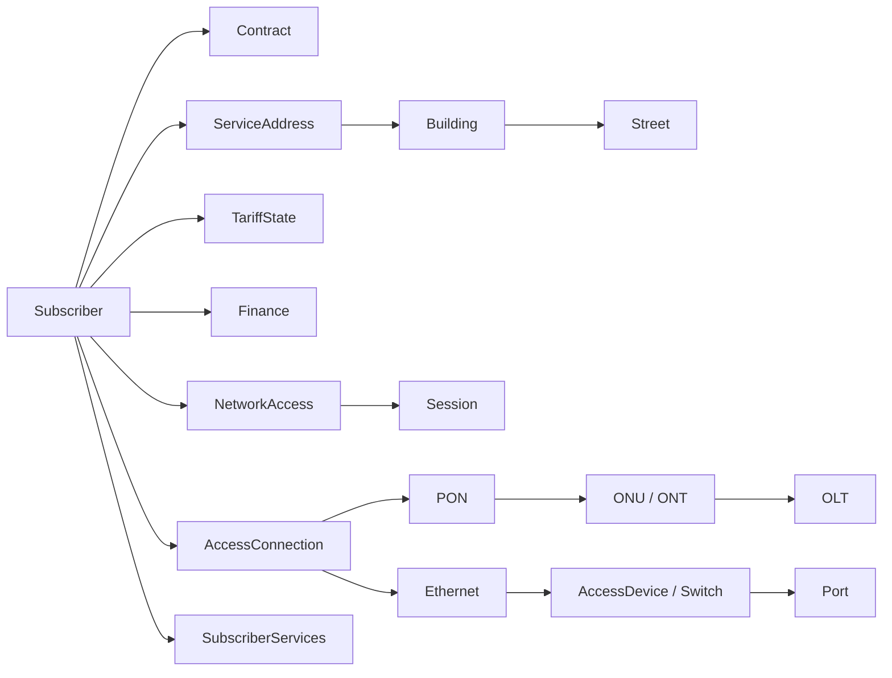
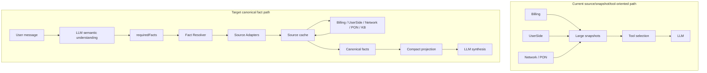
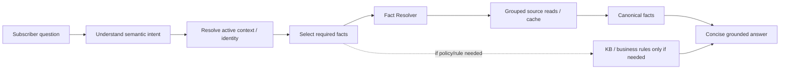
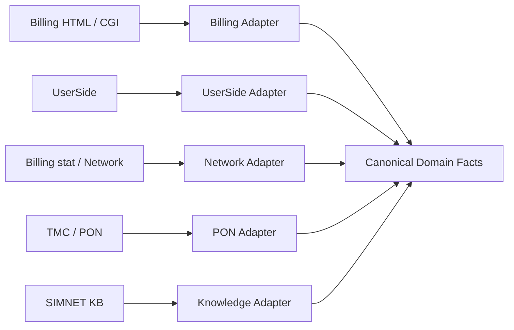
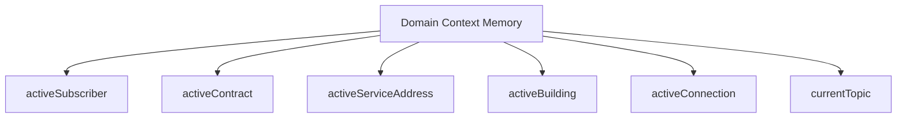

# Visual Maps — Canonical Domain / Fact Resolver

These diagrams are **conceptual architecture targets**, not proof that every shown field already exists. Confirm concrete fields against repo parsers and real tool evidence.

## 1. Target domain graph



The important semantic point is that `Building`, `Street`, `OLT`, access devices and tariff/service definitions are not just anonymous fields inside one broad subscriber snapshot. They are entities or references with their own ownership and reuse semantics.

---

## 2. Current vs target runtime



Key rule: a source/cache may be broad, while the projection sent to the model should be narrow and request-specific.

---

## 3. Decision chain for subscriber questions



Examples:

```text
"Какой у меня тариф?"
→ subscriber.tariff.current.name
```

```text
"Есть ли долг?"
→ subscriber.finance.balance.account
→ subscriber.finance.totalDue
```

```text
"На этом доме GPON есть?"
→ active Subscriber
→ ServiceAddress
→ Building
→ building.gpon
```

```text
"А КТВ там есть?"
→ reuse activeBuilding
→ building.ktv
```

---

## 4. Source adapters and canonical ownership



Example mapping:

```text
Billing dopfield_5
→ Billing Adapter
→ subscriber.serviceAddress.street
```

```text
Billing main summary finance.price
→ Billing Adapter
→ subscriber.tariff.current.price
```

```text
UserSide/TMC pon.onuSerial
→ PON Adapter
→ subscriber.access.pon.onu.serial
```

```text
UserSide Building fields.gpon
→ Building Adapter
→ building.gpon
```

---

## 5. Context memory



This is separate from transcript memory. It lets references like `там`, `на этом доме`, `у него`, `по этому договору` resolve against explicit active entities instead of relying only on replaying a large text history.
